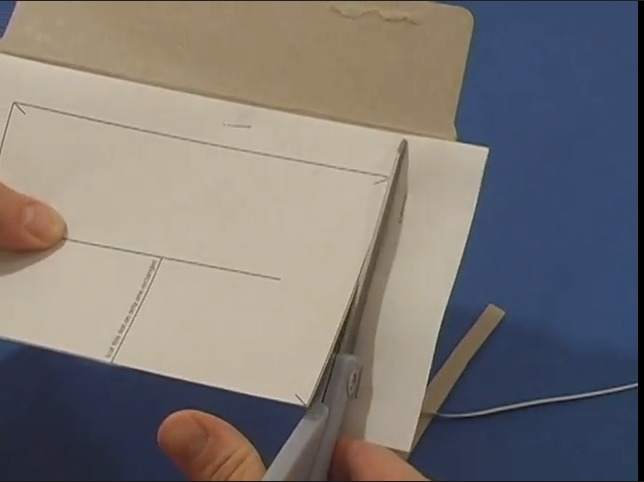
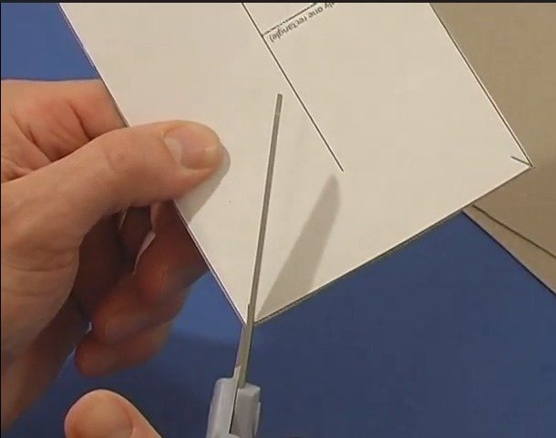
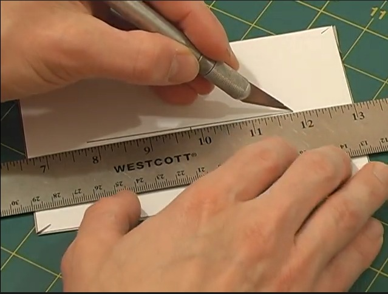
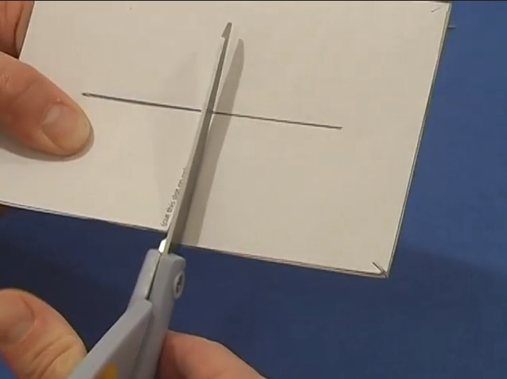
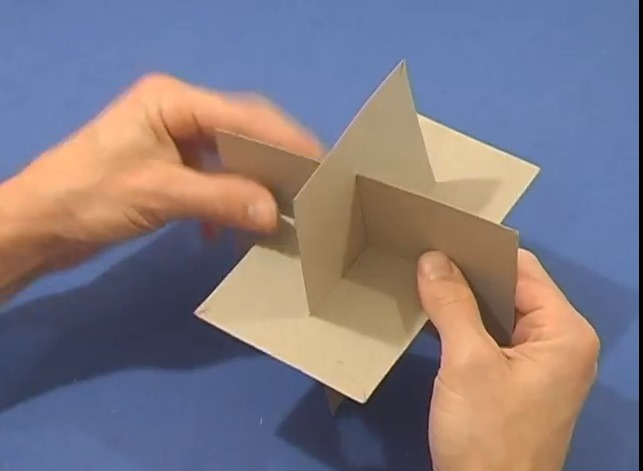
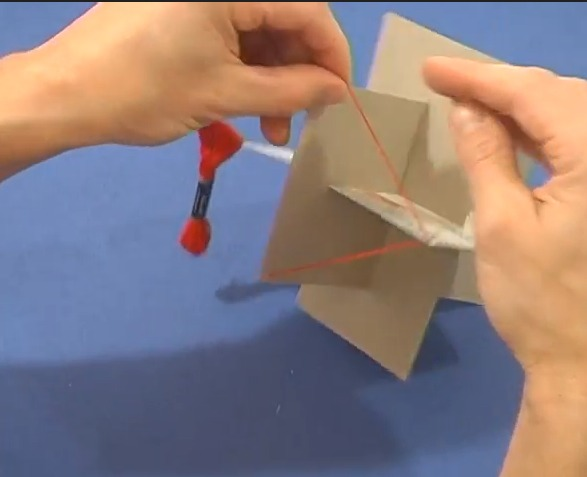
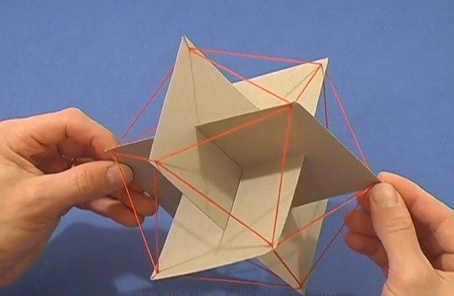

[Proofs](https://www.goldennumber.net/geometry/)

<u>Made By: Daniel & Ryan</u>

# What is a Golden Ratio ?  
Golden ratio, also known as the golden section, golden mean, or divine proportion, in mathematics,  
the irrational number (1 + Square root of√5)/2, often denoted by the Greek letter ϕ or τ, which is  
approximately equal to 1.618

# Instructions on making the Icosahedron
Step1                      |  Step2                      | Step3                      | Step4
:-------------------------:|:-------------------------:  |:-------------------------: |:-------------------------: 
|  | |
Step5                      |  Step6                      | Step7                      | Step8
|  | |

  
  
  

* Cut out 3 rectangles from box board.

* Cut short slits in each of the corners.

* Cut a slit down the middle of each one. You might need to make these slits wider.

* Slip the 3 rectangles together through the slits.

* Tape some thread to one of the corners and connect the thread to all neighboring slits till you have an icosahedron.

